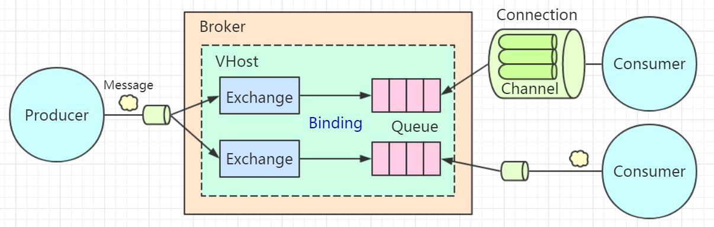

MQ本质分布式系统中的进程通信

# MQ特点

* 独立服务
* 队列（先进先出）
* 发布订阅模式

# MQ使用场景

* 异步通信
* 解耦
* 削峰

# MQ缺点

* 系统可用性降低
* 复杂性增高

# RabbitMQ基础

使用Erlang语言开发，使用AMQP协议（高级消息队列协议，是一个工作于应用层的协议 ）

## 工作模型



* broker 

  RabbitMQ服务器

* connection

  生产者或消费者与Broker建立的TCP长连接

* channel

  消息通道，虚拟的连接，在保持长连接里面去创建和释放channel，减少资源消耗

* queue

  用来存储消息

* exchange

  交换机用来实现消息的灵活路由，是一个绑定列表，来查找匹配和绑定关系；生产者发送消息需要携带路由键（Routing Key），交换机收到消息根据绑定列表路由到队列上；

  队里使用绑定键（Binging Key）与交换机建立绑定关系

* Vhost

  虚拟主机，提高硬件资源利用率，资源隔离和权限控制，类似编程语言的namespace；不同的业务系统创建不同的用户（User），然后给这些用户分配 VHOST 的权限 

## 路由方式

* 直连 Direct 

  队列与直连类型的交换机绑定，需指定一个精确的绑定键，生产者发送消息时携带的路由键与其中的某个绑定键完全匹配，这条消息才会从交换机路由到满足路由关系的此队列上 

  

* 主题 Topic 

  队列与主题类型的交换机绑定时，可以在绑定键中使用通配符。

  两个通配符： 

  #代表0 个或者多个单词

  *代表一个单词


解读：第一个队列支持路由键以 junior 开头的消息路由，后面可以有单词，也可以没有。
第二个队列支持路由键以 netty 开头，并且后面是一个单词的消息路由。
第三个队列支持路由键以 jvm 结尾，并且前面是一个单词的消息路由。 

* 广播 Fanout 

  主题类型的交换机与队列绑定时，不需要指定绑定键。因此生产者发送消息到广播
  类型的交换机上，也不需要携带路由键。消息达到交换机时，所有与之绑定了的队列，
  都会收到相同的消息的副本。 

  

## TTL

TTL(Time To Live) 

1、消息的过期时间 

两种设置方式：
1） 通过队列属性设置消息过期时间

所有队列中的消息超过时间未被消费时，都会过期 

```java
@Bean("ttlQueue")
public Queue queue() {
Map<String, Object> map = new HashMap<String, Object>();
map.put("x-message-ttl", 11000); // 队列中的消息未被消费 11 秒后过期
return new Queue("TTL_QUEUE", true, false, false, map);
}
```

2） 设置单条消息的过期时间
在发送消息的时候指定消息属性。 

```java
MessageProperties messageProperties = new MessageProperties();
messageProperties.setExpiration("4000"); // 消息的过期属性， 单位 ms
Message message = new Message("这条消息 4 秒后过期".getBytes(), messageProperties);
rabbitTemplate.send("TTL_EXCHANGE", "test.ttl", message);
```

> 如果同时指定了 Message TTL 和 Queue TTL，则小的那个时间生效 

## 死信队列 

消息在某些情况下会变成死信（Dead Letter）。
队列在创建的时候可以指定一个死信交换机 DLX（Dead Letter Exchange）。死信交换机绑定的队列被称为死信队列 DLQ（Dead Letter Queue），DLX 实际上也是普通的交换机，DLQ 也是普通的队列（例如替补球员也是普通球员）。 


**什么情况下消息会变成死信？**
1）消息被消费者拒绝并且未设置重回队列：(NACK || Reject ) && requeue== false
2）消息过期
3）队列达到最大长度，超过了 Max length（消息数）或者 Max length bytes（字节数），最先入队的消息会被发送到 DLX。 

### **死信队列使用** 

1、声明原交换机（ORI_USE_EXCHANGE）、原队列（ORI_USE_QUEUE） 相互绑定 

队列中的消息 10 秒钟过期，因为没有消费者，会变成死信。指定原队列的死信交换机（DEAD_LETTER_EXCHANGE）。 

```java
@Bean("oriUseExchange")
public DirectExchange exchange() {
return new DirectExchange("ORI_USE_EXCHANGE", true, false, new HashMap<>());
}

@Bean("oriUseQueue")
public Queue queue() {
Map<String, Object> map = new HashMap<String, Object>();
map.put("x-message-ttl", 10000); // 10 秒钟后成为死信
map.put("x-dead-letter-exchange", "DEAD_LETTER_EXCHANGE"); // 队列中的消息变成死信后， 进入死信交换机
return new Queue("ORI_USE_QUEUE", true, false, false, map);
}

@Bean
public Binding binding(@Qualifier("oriUseQueue") Queue queue,@Qualifier("oriUseExchange") DirectExchange exchange) {
return BindingBuilder.bind(queue).to(exchange).with("test.ori.use");
}
```

2 、 声 明 死 信 交 换 机 （ DEAD_LETTER_EXCHANGE ） 、 死 信 队 列（DEAD_LETTER_QUEUE），相互绑定 

```java
@Bean("deatLetterExchange")
public TopicExchange deadLetterExchange() {
return new TopicExchange("DEAD_LETTER_EXCHANGE", true, false, new HashMap<>());
}

@Bean("deatLetterQueue")
public Queue deadLetterQueue() {
return new Queue("DEAD_LETTER_QUEUE", true, false, false, new HashMap<>());
}

@Bean
public Binding bindingDead(@Qualifier("deatLetterQueue") Queue queue,@Qualifier("deatLetterExchange")
TopicExchange exchange) {
return BindingBuilder.bind(queue).to(exchange).with("#"); // 无条件路由
}
```

3、最终消费者监听死信队列。
4、生产者发送消息。 

**消息流转图** 


## 延迟队列

RabbitMQ 本身不支持延迟队列，总的来说有三种实现方案：

1、 先存储到数据库，用定时任务扫描

2、 利用 RabbitMQ 的死信队列（Dead Letter Queue）实现
3、 利用 rabbitmq-delayed-message-exchange 插件  

### TTL+DLX 的实现

基于消息 TTL，利用死信队列（DLQ）实现延迟队列总体步骤：
1）创建一个交换机
2）创建一个队列，与上述交换机绑定，并且通过属性指定队列的死信交换机。
3）创建一个死信交换机
4）创建一个死信队列
4）将死信交换机绑定到死信队列
5）消费者监听死信队列 

消息的流转流程：
生产者——原交换机——原队列（超过 TTL 之后）——死信交换机——死信队列——最终消费者 

**使用死信队列实现延时消息的缺点**：
1） 如果统一用队列来设置消息的 TTL，当梯度非常多的情况下，比如 1 分钟，2分钟，5 分钟，10 分钟，20 分钟，30 分钟……需要创建很多交换机和队列来路由消息。
2） 如果单独设置消息的 TTL，则可能会造成队列中的消息阻塞——前一条消息没
有出队（没有被消费），后面的消息无法投递（比如第一条消息过期 TTL 是 30min，第二条消息 TTL 是 10min。10 分钟后，即使第二条消息应该投递了，但是由于第一条消息还未出队，所以无法投递）。
3） 可能存在一定的时间误差。 

### 基于延迟队列插件的实现（ Linux） 

在 RabbitMQ 3.5.7 及 以 后 的 版 本 提 供 了 一 个 插 件
（rabbitmq-delayed-message-exchange）来实现延时队列功能。同时插件依赖Erlang/OPT 18.0 及以上。
插件源码地址：
https://github.com/rabbitmq/rabbitmq-delayed-message-exchange
插件下载地址：
https://bintray.com/rabbitmq/community-plugins/rabbitmq_delayed_message_exchange 

1 、下载插件 

```shell
wget
https://bintray.com/rabbitmq/community-plugins/download_file?file_path=rabbitmq_delayed_message_exchange-0.0.1.ez
```

如果下载的文件名带问号则需要改名

```shell
mv download_file?file_path=rabbitmq_delayed_message_exchange-0.0.1.ez
rabbitmq_delayed_message_exchange-0.0.1.e
```

2、启用插件 

```shell
rabbitmq-plugins enable rabbitmq_delayed_message_exchange

// 停用
rabbitmq-plugins disable rabbitmq_delayed_message_exchange
```

3、插件使用 

通过声明一个 x-delayed-message 类型的 Exchange 来使用 delayed-messaging特性。x-delayed-message 是插件提供的类型，并不是 rabbitmq 本身的（区别于 direct、topic、fanout、headers） 


```java
@Bean("delayExchange")
public TopicExchange exchange() {
Map<String, Object> argss = new HashMap<String, Object>();
argss.put("x-delayed-type", "direct");
return new TopicExchange("DELAY_EXCHANGE", true, false, argss);
}
```

生产者：消息属性中指定 x-delay 参数。 

```java
MessageProperties messageProperties = new MessageProperties();
// 延迟的间隔时间， 目标时刻减去当前时刻
messageProperties.setHeader("x-delay", delayTime.getTime() - now.getTime());
Message message = new Message(msg.getBytes(), messageProperties);

// 不能在本地测试， 必须发送消息到安装了插件的 Linux 服务端
rabbitTemplate.send("DELAY_EXCHANGE", "#", message);
```

## 服务端流控（Flow Control） 

当 RabbitMQ 生产 MQ 消息的速度远大于消费消息的速度时，会产生大量的消息堆积，占用系统资源，导致机器的性能下降。我们想要控制服务端接收的消息的数量，应该怎么做呢 ?

队列有两个控制长度的属性：
x-max-length：队列中最大存储最大消息数，超过这个数量，队头的消息会被丢弃。
x-max-length-bytes：队列中存储的最大消息容量（单位 bytes），超过这个容量，队头的消息会被丢弃。 


需要注意的是，设置队列长度只在消息堆积的情况下有意义，而且会删除先入队的消息，不能真正地实现服务端限流。 

### 内存控制

RabbitMQ 会在启动时检测机器的物理内存数值。默认当 MQ 占用 40% 以上内存时，MQ 会主动抛出一个内存警告并阻塞所有连接（Connections）。可以通过修改rabbitmq.config 文件来调整内存阈值，默认值是 0.4，如下所示：  

```shell
[{rabbit, [{vm_memory_high_watermark, 0.4}]}].
```

也可以用命令动态设置，如果设置成 0，则所有的消息都不能发布 

```she
rabbitmqctl set_vm_memory_high_watermark 0.3
```

### 磁盘控制 

当磁盘空间低于指定的值时（默认50MB），触发流控措施。例如：指定为磁盘的 30%或者 2GB 

```sh
disk_free_limit.relative = 3.0
disk_free_limit.absolute = 2GB
```

## 消费端限流 

默认情况下，如果不进行配置，RabbitMQ 会尽可能快速地把队列中的消息发送到消费者。因为消费者会在本地缓存消息，如果消息数量过多，可能会导致 OOM 或者影响其他进程的正常运行。
在消费者处理消息的能力有限，例如消费者数量太少，或者单条消息的处理时间过长的情况下，如果我们希望在一定数量的消息消费完之前，不再推送消息过来，就要用到消费端的流量限制措施。 

可以基于 Consumer 或者 channel 设置 prefetch count 的值，含义为 Consumer 端的最大的 unacked messages 数目。当超过这个数值的消息未被确认，RabbitMQ 会停止投递新的消息给该消费者 

```java
channel.basicQos(2); // 如果超过 2 条消息没有发送 ACK， 当前消费者不再接受队列消息
channel.basicConsume(QUEUE_NAME, false, consumer);
```

**SimpleMessageListenerContainer** 

```java
container.setPrefetchCount(2);
```

**Spring Boot 配置** 

```properties
spring.rabbitmq.listener.simple.prefetch=2
```

> 例如：channel 的 prefetch count 设置为 5。当消费者有 5 条消息没有给 Broker 发送 ACK后，RabbitMQ 不再给这个消费者投递消息。 

## Spring AMQP 

Spring 封装 RabbitMQ 的时候，它做了什么事情？
1、管理对象（队列、交换机、绑定）
2、封装方法（发送消息、接收消息） 

Spring AMQP 是对 Spring 基于 AMQP 的消息收发解决方案，它是一个抽象层，不依赖于特定的 AMQP Broker 实现和客户端的抽象，所以可以很方便地替换。比如我们可以使用 spring-rabbit 来实现 

```xml
<dependency>
	<groupId>org.springframework.amqp</groupId>
	<artifactId>spring-rabbit</artifactId>
	<version>1.3.5.RELEASE</version>
</dependency>
```

### Spring AMQP 核心组件 

* ConnectionFactory
  Spring AMQP 的连接工厂接口，用于创建连接。CachingConnectionFactory 是 ConnectionFactory 的一个实现类。 

* RabbitAdmin 

  RabbitAdmin 是 AmqpAdmin 的实现，封装了对 RabbitMQ 的基础管理操作，比如对交换机、队列、绑定的声明和删除等 

```java
// 声明一个交换机
rabbitAdmin.declareExchange(new DirectExchange("ADMIN_EXCHANGE", false, false));

// 声明一个队列
rabbitAdmin.declareQueue(new Queue("ADMIN_QUEUE", false, false, false));

// 声明一个绑定
rabbitAdmin.declareBinding( new Binding("ADMIN_QUEUE", Binding.DestinationType.QUEUE,
"ADMIN_EXCHANGE", "admin", null));
```

>  为什么我们在配置文件（Spring）或者配置类（SpringBoot）里面定义了交换机、
> 队列、绑定关系，并没有直接调用 Channel 的 declare 的方法，Spring 在启动的时候就可以帮我们创建这些元数据？这些事情就是由 RabbitAdmin 完成的。RabbitAdmin 实 现 了 InitializingBean 接 口 ， 里 面 有 唯 一 的 一 个 方 法afterPropertiesSet()，这个方法会在 RabbitAdmin 的属性值设置完的时候被调用。在 afterPropertiesSet ()方法中，调用了一个 initialize()方法。这里面创建了三个 Collection，用来盛放交换机、队列、绑定关系。
> 最后依次声明返回类型为 Exchange、Queue 和 Binding 这些 Bean，底层还是调用了 Channel 的 declare 的方法 

```java
declareExchanges(channel, exchanges.toArray(new Exchange[exchanges.size()]));
declareQueues(channel, queues.toArray(new Queue[queues.size()]));
declareBindings(channel, bindings.toArray(new Binding[bindings.size()]));
```

* Message 

  Message 是 Spring AMQP 对消息的封装。两个重要的属性：
  body：消息内容。
  messageProperties：消息属性 

* RabbitTemplate 消息模板 

  RabbitTemplate 是 AmqpTemplate 的一个实现（目前为止也是唯一的实现），用来简化消息的收发，支持消息的确认（Confirm）与返回（Return）。跟 JDBCTemplate一 样 ， 它 封 装 了 创 建 连 接 、 创 建 消 息 信 道 、 收 发 消 息 、 消 息 格 式 转 换（ConvertAndSend→Message）、关闭信道、关闭连接等等操作 

  针对于多个服务器连接，可以定义多个 Template。可以注入到任何需要收发消息的地方使用。 

* MessageListener 消息监听

  * `MessageListener`
    `MessageListener` 是 Spring AMQP 异步消息投递的监听器接口，它只有一个方法onMessage，用于处理消息队列推送来的消息，作用类似于 Java API 中的 Consumer。 

  * `MessageListenerContainer`
    `MessageListenerContainer` 可以理解为 MessageListener 的容器，一个 Container
    只有一个 Listener，但是可以生成多个线程使用相同的 MessageListener 同时消费消息。Container 可以管理 Listener 的生命周期，可以用于对于消费者进行配置。例如：动态添加移除队列、对消费者进行设置，例如 ConsumerTag、Arguments、并发、消费者数量、消息确认模式等等。 

  ```java
  @Bean
  public SimpleMessageListenerContainer messageContainer(ConnectionFactory connectionFactory) {
      SimpleMessageListenerContainer container = new SimpleMessageListenerContainer(connectionFactory);
      container.setQueues(getSecondQueue(), getThirdQueue()); //监听的队列
      container.setConcurrentConsumers(1); // 最小消费者数
      container.setMaxConcurrentConsumers(5); // 最大的消费者数量
      container.setDefaultRequeueRejected(false); //是否重回队列
      container.setAcknowledgeMode(AcknowledgeMode.AUTO); //签收模式
      container.setExposeListenerChannel(true);
      container.setConsumerTagStrategy(new ConsumerTagStrategy() { //消费端的标签策略
      @Override
      public String createConsumerTag(String queue) {
      return queue + "_" + UUID.randomUUID().toString();
      }
  });
  return container;
  }
  ```

  * MessageListenerContainerFactory 

    Spring 去整合 IBM MQ、JMS、Kafka 也是这么做的 

    ```java
    @Bean
    public SimpleRabbitListenerContainerFactory rabbitListenerContainerFactory(ConnectionFactory connectionFactory)
    {
        SimpleRabbitListenerContainerFactory factory = new SimpleRabbitListenerContainerFactory();
        factory.setConnectionFactory(connectionFactory);
        factory.setMessageConverter(new Jackson2JsonMessageConverter());
        factory.setAcknowledgeMode(AcknowledgeMode.NONE);
        factory.setAutoStartup(true);
        return factory;
    }
    ```

    可以在消费者上指定，当我们需要监听多个 RabbitMQ 的服务器的时候，指定不同的 MessageListenerContainerFactory。 

    ```java
    @Component
    @PropertySource("classpath:mq.properties")
    @RabbitListener(queues = "${com.test.firstqueue}", containerFactory="rabbitListenerContainerFactory")
    public class FirstConsumer {
    @RabbitHandler
    public void process(@Payload Merchant merchant){
        System.out.println("First Queue received msg : " + merchant.getName());
        }
    }
    ```

* 转换器 MessageConvertor 

  **MessageConvertor 的作用？**
  RabbitMQ 的消息在网络传输中需要转换成 byte[]（字节数组）进行发送，消费者需要对字节数组进行解析。
  在 Spring AMQP 中，消息会被封装为 org.springframework.amqp.core.Message对象。消息的序列化和反序列化，就是处理 Message 的消息体 body 对象。 

  如果消息已经是 byte[]格式，就不需要转换。
  如果是 String，会转换成 byte[]。如果是 Java 对象，会使用 JDK 序列化将对象转换为 byte[]（体积大，效率差）。在 调 用 RabbitTemplate 的 convertAndSend() 方 法 发 送 消 息 时 ， 会 使 用MessageConvertor 进行消息的序列化，默认使用 SimpleMessageConverter。在某些情况下，我们需要选择其他的高效的序列化工具。如果我们不想在每次发送消息时自己处理消息，就可以直接定义一个 MessageConvertor 

  ```java
  @Bean
  public RabbitTemplate rabbitTemplate(final ConnectionFactory connectionFactory) {
  final RabbitTemplate rabbitTemplate = new RabbitTemplate(connectionFactory);
  rabbitTemplate.setMessageConverter(new Jackson2JsonMessageConverter());
  return rabbitTemplate;
  }
  ```

  **MessageConvertor 如何工作？**
  调 用 了 RabbitTemplate 的 convertAndSend() 方 法 时 会 使 用 对 应 的
  MessageConvertor 进行消息的序列化和反序列化。
  序列化：Object —— Json —— Message(body) —— byte[]
  反序列化：byte[] ——Message —— Json —— Object 

  有哪些 MessageConvertor？ 

  在 Spring 中提供了一个默认的转换器：SimpleMessageConverter。
  Jackson2JsonMessageConverter（RbbitMQ 自带）：将对象转换为 json，然后再转换成字节数组进行传递。 

  **如何自定义 MessageConverter？**
  例如：使用 Gson 格式化消息：创建一个类，实现 MessageConverter 接口，重写 toMessage()和 fromMessage()方法。
  toMessage(): Java 对象转换为 Message
  fromMessage(): Message 对象转换为 Java 对象  

# RabbitMQ可靠性投递 


1 代表消息从生产者发送到 Broker 

生产者把消息发到 Broker 之后，怎么知道自己的消息有没有被 Broker 成功接收？
2 代表消息从 Exchange 路由到 Queue
Exchange 是一个绑定列表，如果消息没有办法路由到正确的队列，会发生什么事情？应该怎么处理？
3 代表消息在 Queue 中存储队列是一个独立运行的服务，有自己的数据库（Mnesia），它是真正用来存储消
息的。如果还没有消费者来消费，那么消息要一直存储在队列里面。如果队列出了问题，消息肯定会丢失。怎么保证消息在队列稳定地存储呢？
4 代表消费者订阅 Queue 并消费消息
队列的特性是什么？FIFO。队列里面的消息是一条一条的投递的，也就是说，只有上一条消息被消费者接收以后，才能把这一条消息从数据库删掉，继续投递下一条消息。那么问题来了，Broker 怎么知道消费者已经接收了消息呢？ 

## 消息发送到 RabbitMQ 服务器 

在 RabbitMQ 里面提供了两种机制服务端确认机制，也就是在生产者发送消息给RabbitMQ 的服务端的时候，服务端会通过某种方式返回一个应答，只要生产者收到了这个应答，就知道消息发送成功了。
**第一种是 Transaction（事务）模式，第二种 Confirm（确认）模式。** 

* Transaction（事务） 模式 

  通过一个 channel.txSelect()的方法把信道设置成事务模式，然后就可以发布消息给 RabbitMQ 了，如果 channel.txCommit();的方法调用成功，就说明事务提交成功，则消息一定到达了 RabbitMQ 中。
  如果在事务提交执行之前由于 RabbitMQ 异常崩溃或者其他原因抛出异常，这个时候我们便可以将其捕获，进而通过执行 channel.txRollback()方法来实现事务回滚 

  在事务模式里面，只有收到了服务端的 Commit-OK 的指令，才能提交成功。所以可以解决生产者和服务端确认的问题。但是事务模式有一个缺点，它是阻塞的，一条消息没有发送完毕，不能发送下一条消息，它会榨干 RabbitMQ 服务器的性能。所以不建
  议大家在生产环境使用。 

  Spring Boot 中的设置： 

  ```java
  rabbitTemplate.setChannelTransacted(true);
  ```

* Confirm（确认） 模式 

  确认模式有三种，普通确认模式 、批量确认 模式、异步确认模式 

  * 普通确认模式

    在生产者这边通过调用 channel.confirmSelect()方法将信道设置为 Confirm 模式，然后发送消息。一旦消息被投递到所有匹配的队列之后，RabbitMQ 就会发送一个确认（Basic.Ack）给生产者，也就是调用 channel.waitForConfirms()返回 true，这样生产者就知道消息被服务端接收了 

  * 批量确认 模式

    在 开 启 Confirm 模 式 后 ， 先 发 送 一 批 消 息 。 只 要
    channel.waitForConfirmsOrDie();方法没有抛出异常，就代表消息都被服务端接收了 

    > 缺点：第一个就是批量
    > 的数量的确定。对于不同的业务，到底发送多少条消息确认一次？数量太少，效率提升不上去。数量多的话，又会带来另一个问题，比如我们发 1000 条消息才确认一次，如果前面 999 条消息都被服务端接收了，如果第 1000 条消息被拒绝了，那么前面所有的消息都要重发 

  * 异步确认模式 

    异步确认模式需要添加一个 ConfirmListener，并且用一个 SortedSet 来维护没有被确认的消息。
    Confirm 模式是在 Channel 上开启的，因为 RabbitTemplate 对 Channel 进行了封装，叫做 ConfimrCallback

    ```java
    rabbitTemplate.setConfirmCallback(new RabbitTemplate.ConfirmCallback() {
    @Override
        public void confirm(CorrelationData correlationData, boolean ack, String cause) {
        if (!ack) {
        System.out.println("发送消息失败： " + cause);
        throw new RuntimeException("发送异常： " + cause);
        }
    }
    });
    ```

## 消息从交换机路由到队列 

第二个环节就是消息从交换机路由到队列。在什么情况下，消息会无法路由到正确的队列？可能因为路由键错误，或者队列不存在。 

我们有两种方式处理无法路由的消息，一种就是让服务端重发给生产者，一种是让交换机路由到另一个备份的交换机。 

* 消息回发的方式

  使用 mandatory 参数和 ReturnListener（在 Spring AMQP 中是ReturnCallback） 

  ```java
  rabbitTemplate.setMandatory(true);
  rabbitTemplate.setReturnCallback(new RabbitTemplate.ReturnCallback(){
      public void returnedMessage(Message message,
      int replyCode,
      String replyText,
      String exchange,
      String routingKey){
      System.out.println("回发的消息： ");
      System.out.println("replyCode: "+replyCode);
      System.out.println("replyText: "+replyText);
      System.out.println("exchange: "+exchange);
      System.out.println("routingKey: "+routingKey);
      }
  });    
  ```

* 消息路由到备份交换机的方式 

  在创建交换机的时候，从属性中指定备份交换机 

  ```java
  Map<String,Object> arguments = new HashMap<String,Object>();
  arguments.put("alternate-exchange","ALTERNATE_EXCHANGE"); // 指定交换机的备份交换机
  
  channel.exchangeDeclare("TEST_EXCHANGE","topic", false, false, false, arguments);
  
  ```

  > （注意区别，队列可以指定死信交换机；交换机可以指定备份交换机） 

## 消息在队列存储 

第三个环节是消息在队列存储，如果没有消费者的话，队列一直存在在数据库中。如果 RabbitMQ 的服务或者硬件发生故障，比如系统宕机、重启、关闭等等，可能会导致内存中的消息丢失，所以我们要把消息本身和元数据（队列、交换机、绑定）都保存到磁盘 

* 队列持久化 

  ```java
  @Bean("testQueue")
  public Queue GpQueue() {
  // queueName, durable, exclusive, autoDelete, Properties
  return new Queue("TEST_QUEUE", true, false, false, new HashMap<>());
  }
  ```

* 交换机持久化 

  ```java
  @Bean("testExchange")
  public DirectExchange exchange() {
  // exchangeName, durable, exclusive, autoDelete, Properties
  return new DirectExchange("TEST_EXCHANGE", true, false, new HashMap<>());
  }
  ```

* 消息持久化 

  ```java
  MessageProperties messageProperties = new MessageProperties();
  messageProperties.setDeliveryMode(MessageDeliveryMode.PERSISTENT);
  Message message = new Message("持久化消息".getBytes(), messageProperties);
  rabbitTemplate.send("GP_TEST_EXCHANGE", "gupao.test", message);
  ```

## 消息投递到消费者 

​		如果消费者收到消息后没来得及处理即发生异常，或者处理过程中发生异常，会导致④失败。服务端应该以某种方式得知消费者对消息的接收情况，并决定是否重新投递这条消息给其他消费者。

​		RabbitMQ 提供了消费者的消息确认机制（message acknowledgement），消费者可以自动或者手动地发送 ACK 给服务端。没有收到 ACK 的消息，消费者断开连接后，RabbitMQ 会把这条消息发送给其他消费者。如果没有其他消费者，消费者重启后会重新消费这条消息，重复执行业务逻辑。

​		消费者在订阅队列时，可以指定 autoAck参数，当 autoAck 等于 false 时，RabbitMQ会等待消费者显式地回复确认信号后才从队列中移去消息。如何设置手动 ACK？
SimpleRabbitListenerContainer 或者 SimpleRabbitListenerContainerFactory 

```java
factory.setAcknowledgeMode(AcknowledgeMode.MANUAL);
```

application.properties 

```properties
spring.rabbitmq.listener.direct.acknowledge-mode=manual
spring.rabbitmq.listener.simple.acknowledge-mode=manual
```

> 注意这三个值的区别：
> NONE：自动 ACK 
>
> MANUAL： 手动 ACK
> AUTO：如果方法未抛出异常，则发送 ack 

当抛出 AmqpRejectAndDontRequeueException 异常的时候，则消息会被拒绝，且不重新入队。当抛出 ImmediateAcknowledgeAmqpException 异常，则消费者会发送 ACK。其他的异常，则消息会被拒绝，且 requeue = true 会重新入队。 

**Spring Boot 中，消费者调用 ACK** 

```java
public class SecondConsumer {
    @RabbitHandler
    public void process(String msgContent,Channel channel, Message message) throws IOException {
    System.out.println("Second Queue received msg : " + msgContent );
    channel.basicAck(message.getMessageProperties().getDeliveryTag(), false);
    }
}
```

> 如果消息无法处理或者消费失败，也有两种拒绝的方式，Basic.Reject()拒绝单条，Basic.Nack()批量拒绝。如果 requeue 参数设置为 true，可以把这条消息重新存入队列，以便发给下一个消费者（当然，只有一个消费者的时候，这种方式可能会出现无限循环重复消费的情况。可以投递到新的队列中，或者只打印异常日志） 

## 消费者回调 

所以，这个是生产者最终确定消费者有没有消费成功的两种方式：
1） 消费者收到消息，处理完毕后，调用生产者的 API（思考：是否破坏解耦？）
2） 消费者收到消息，处理完毕后，发送一条响应消息给生产者 

## 补偿机制 

生产者与消费者之间应该约定一个超时时间，比如 5 分钟，对于超出这个时间没有得到响应的消息，可以设置一个定时重发的机制，但要发送间隔和控制次数，比如每隔 2分钟发送一次，最多重发 3 次，否则会造成消息堆积。

重发可以通过消息落库+定时任务来实现。 

## 消息幂等性 

重复发送的消息，可以对每一条消息生成一个唯一的业务 ID，通过日志或者消息落库来做重复控制。 

## 最终一致 


## 消息的顺序性 

消息的顺序性指的是消费者消费消息的顺序跟生产者生产消息的顺序是一致的 

RabbitMQ 中，一个队列有多个消费者时，由于不同的消费者消费消息的速度是不一样的，顺序无法保证。只有一个队列仅有一个消费者的情况才能保证顺序消费（不同的业务消息发送到不同的专用的队列 )


# RabbitMQ集群与高可用

RabbitMQ 有两种集群模式 : 普通集群模式和镜像队列模式 

集群有两种节点类型，一种是磁盘节点（Disc Node），一种是内存节点（RAM Node）。
磁盘节点：将元数据（包括队列名字属性、交换机的类型名字属性、绑定、vhost）放在磁盘中。
内存节点：将元数据放在内存中。
PS：内存节点会将磁盘节点的地址存放在磁盘（不然重启后就没有办法同步数据了）。
如果是持久化的消息，会同时存放在内存和磁盘。集群中至少需要一个磁盘节点用来持久化元数据，否则全部内存节点崩溃时，就无从同步元数据。未指定类型的情况下，默认为磁盘节点。我们一般把应用连接到内存节点（读写快），磁盘节点用来备份。 

**集群的配置步骤**：
1、配置 hosts
2、同步 erlang.cookie
3、加入集群（join cluster） 

## 普通集群模式

普通集群模式下，不同的节点之间只会相互同步元数据。 


> 缺点:普通集群模式不能保证队列的高可用性，因为队列内容不会复制。如果节点失效将导致相关队列不可用 


## 镜像队列模式 

镜像队列模式下，消息内容会在镜像节点间同步，可用性更高。不过也有一定的副作用，系统性能会降低，节点过多的情况下同步的代价比较大。 

| 操作方式              | 命令或步骤                                                   |
| --------------------- | ------------------------------------------------------------ |
| rabbitmqctl (Windows) | rabbitmqctl set_policy ha-all "^ha." "{""ha-mode"":""all""}" |
| HTTP API              | PUT /api/policies/%2f/ha-all {"pattern":"^ha.", "definition":{"ha-mode":"all"}} |
| Web UI                | 1、 avigate to Admin > Policies > Add / update a policy 2、 Name 输入： mirror_image 3、 Pattern 输入： ^（ 代表匹配所有） 4、 Definition 点击 HA mode， 右边输入： all 5、 Add policy |


### 同步过程

参考链接 https://blog.csdn.net/jaredcoding/article/details/78112016

## 高可用

需要一个负载均衡的组件（例如 HAProxy，LVS，Nignx），由负载的组件来做路由。这个时候，只需要连接到负载组件的 IP 地址就可以了 


四层负载：工作在 OSI 模型的第四层，即传输层（TCP 位于第四层），它是根据 IP端口进行转发（LVS 支持四层负载）。RabbitMQ 是 TCP 的 5672 端口。
七层负载：工作在第七层，应用层（HTTP 位于第七层）。可以根据请求资源类型分配到后端服务器（Nginx 支持七层负载；HAProxy 支持四层和七层负载） 

需要这样一个组件：
1、 它本身有路由（负载）功能，可以监控集群中节点的状态（比如监控HAProxy），如果某个节点出现异常或者发生故障，就把它剔除掉。

2、 为了提高可用性，它也可以部署多个服务，但是只有一个自动选举出来的 MASTER 服务器（叫做主路由器），通过广播心跳消息实现。

3、 MASTER 服务器对外提供一个虚拟 IP，提供各种网络功能。也就是谁抢占到 VIP，就由谁对外提供网络服务。应用端只需要连接到这一个 IP 就行了。

这个协议叫做 VRRP 协议（虚拟路由冗余协议 Virtual Router RedundancyProtocol），这个组件就是Keepalived，它具有 Load Balance 和 High Availability的功能。
下面我们看下用 HAProxy 和 Keepalived 如何实现 RabbitMQ 的高可用
（MySQL、Mycat、Redis 类似）。 


# 基于Docker安装RabbitMQ

1、拉取镜像（选择带有“mangement”的版本（**包含web管理页面**））

```sh
docker pull rabbitmq:3.7.7-management
```

2、docker images 查看所有镜像，查看Image ID 

3、根据下载的镜像创建和启动容器

```shell
docker run -d --name rabbitmq3.7.7 -p 5672:5672 -p 15672:15672 -v `pwd`/data:/var/lib/rabbitmq --hostname myRabbit -e RABBITMQ_DEFAULT_VHOST=my_vhost  -e RABBITMQ_DEFAULT_USER=admin -e RABBITMQ_DEFAULT_PASS=admin rabbitmq:3.7.7-management
```

> 说明：
>
> -d 后台运行容器；
>
> --name 指定容器名；
>
> -p 指定服务运行的端口（5672：应用访问端口；15672：控制台Web端口号）；
>
> -v 映射目录或文件；
>
> --hostname  主机名（RabbitMQ的一个重要注意事项是它根据所谓的 “节点名称” 存储数据，默认为主机名）；
>
> -e 指定环境变量；（RABBITMQ_DEFAULT_VHOST：默认虚拟机名；RABBITMQ_DEFAULT_USER：默认的用户名；RABBITMQ_DEFAULT_PASS：默认用户名的密码）
>
> 

4、使用命令：docker ps 查看正在运行容器